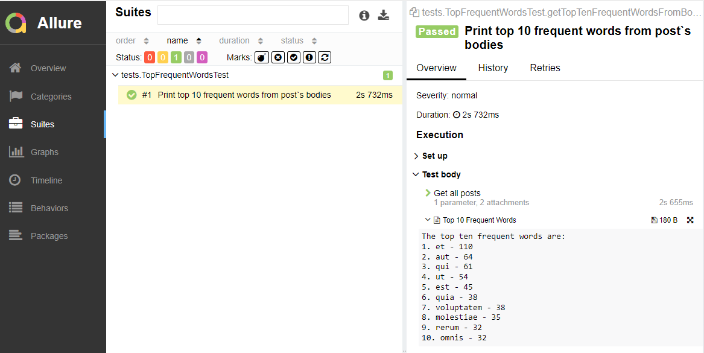
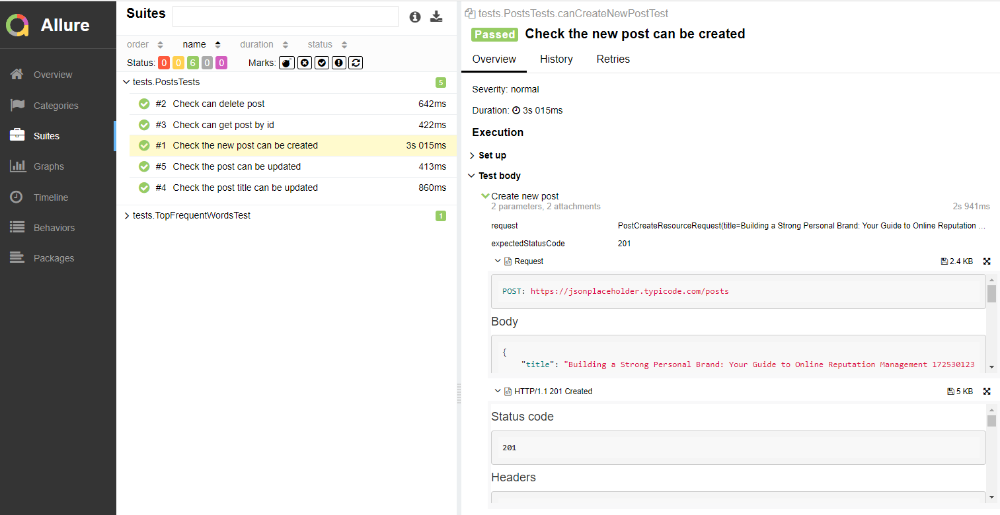

This is a solution for an API test for the https://jsonplaceholder.typicode.com/ endpoint.
Only CRUD tests for /posts module are represented here.

To run all tests, use the command:
`gradle clean test`

To generate an allure report, use the command:
`gradle allureServe`

The result should be like this:

